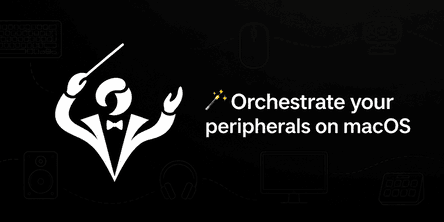

<p align="center">
  <a href="https://github.com/GuilhermeAlbert/harmoni">
    
  </a>
</p>

# Harmoni

Harmoni is a macOS desktop application for centralized audio, camera,
peripheral, permission, and local profile management.

## Architecture

Harmoni uses the following local desktop architecture:

1. A Next.js App Router frontend built with React, strict TypeScript, and
   Tailwind CSS.
2. A static Next.js export embedded directly in the Tauri application, with no
   Next.js runtime server.
3. A Tauri 2 host written in Rust that owns the desktop boundary and exposes
   narrow, typed commands to the frontend.
4. A bundled Swift executable that integrates with supported public macOS APIs for
   platform-specific device operations.

The native request path is:

```text
Next.js → frontend service → Tauri command → Rust → Swift → typed response
```

## Toolchain policy

- Node.js 24.14.1, selected through `.nvmrc`
- Yarn 1.22.22, declared by `packageManager` and `engines`
- Stable Rust with the minimal profile, rustfmt, and Clippy
- Swift from the active Xcode command-line toolchain

Use the exact Node and Yarn versions declared by the repository before running
development or packaging commands.

## Local development

```bash
make install
make dev
```

Run `make help` to list all commands. Common targets are:

- `make web-dev` — run only the Next.js frontend.
- `make validate` — run version, frontend, Rust, and Swift validation.
- `make package` — validate and build local unsigned `.app` and DMG artifacts.

The equivalent low-level Yarn and Cargo commands remain available for CI and
focused debugging.

## Supported capabilities

- **Audio:** Discover Core Audio inputs and outputs, identify current defaults,
  change supported defaults, and read or change volume and mute only when the
  selected device exposes those properties.
- **Cameras:** Discover AVFoundation cameras, keep a Harmoni-local preferred
  camera, and run an explicit local preview session. Preview data stays on the
  Mac and capture stops on Stop, route exit, camera change, or application exit.
- **Camera controls:** Zoom and exposure controls are hidden on macOS because
  the public AVFoundation SDK does not expose the reversible device mutations
  required by Harmoni.
- **Peripherals:** Discover user-operable HID keyboards, mice, trackpads, and
  controllers. Harmoni does not claim generic enable or disable control.
- **Lighting:** Connected HID lighting metadata may be inspected read-only, but
  no LED write is sent unless a documented device-specific protocol is verified.
- **Profiles:** Persist local schema-v2 profiles, migrate valid v1 storage with a
  backup, preflight every requested operation, report partial results, and stop
  Harmoni's own camera preview for Private profiles. Profiles do not disable all
  cameras system-wide.
- **Permissions:** Read camera, microphone, Accessibility, and Input Monitoring
  status where public macOS APIs allow it, and open the corresponding System
  Settings pane only after user action.
- **Live state:** Supervised native watchers reconcile audio, camera, and HID
  changes without substituting fixture data after native failures.

Known limitations include no generic HID disable, no verified LED writes for
the currently tested Keychron/Fifine identities, no global default-camera API,
and no system-wide camera privacy switch. Signing and notarization require the
Apple credentials described below.

## Versions and macOS packages

The version must match in `package.json`, `src-tauri/Cargo.toml`,
`src-tauri/tauri.conf.json`, and the Swift agent. Run `yarn version:check`
before creating a tag.

Pull requests run frontend, Rust, and Swift validation on macOS. A GitHub
Release is created only when an explicit `v<version>` tag is pushed, for
example `v0.1.0`. A tag whose version differs from the application files fails
before packaging.

Tagged builds attach an architecture-native DMG, a zipped `.app`, and a
`SHA256SUMS.txt` file. Apple Silicon is the recommended initial distribution
target; the workflow does not promise a separate x86_64 artifact.

Signing and notarization are conditional. Configure `APPLE_CERTIFICATE`,
`APPLE_CERTIFICATE_PASSWORD`, `APPLE_SIGNING_IDENTITY`, `APPLE_ID`,
`APPLE_PASSWORD`, and `APPLE_TEAM_ID` as GitHub Actions secrets to enable the
Tauri signing flow. Without the complete secret set, artifacts are unsigned
and macOS Gatekeeper may require users to approve them manually.

## Development principles

- Keep source code, identifiers, technical documentation, and commits in
  English.
- Prefer small, explicit boundaries and avoid abstractions without real use.
- Do not replace native failures with fixture data.
- Treat unsupported macOS operations as explicit capabilities.
